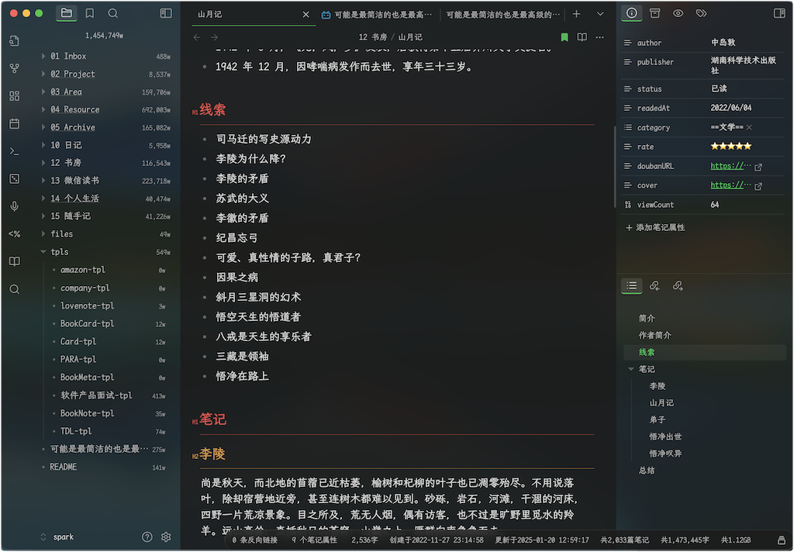
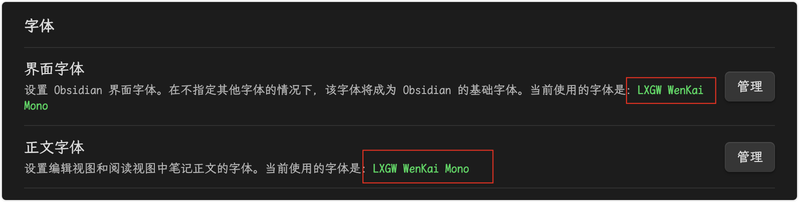

Zen 是一个专注于写作而优化的 Obsidian 主题，支持桌面端和手机。去除了影响写作和阅读的冗余元素，具有简洁现代化的风格。同时针对中文用户做了专门的优化。

**为了确保序号和引导线对齐，以及有更好的中文体验，请安装附件里的字体**：`LXGWWenKaiMono-Regular.ttf`

- 当前使用字体：https://github.com/lxgw/LxgwWenKai/releases/download/v1.510/LXGWWenKaiMono-Regular.ttf
- 其他字体参考： https://github.com/lxgw/LxgwWenKai

**Support development:** [follow me](https://github.com/laughtmaker)

## About Zen

- [Screenshots](#screenshots)
- [Installation](#installation)

## Screenshots

1. 对整体页面做了优化，去除了很多分隔线，整体更遍平化，也更透气；
2. 两侧边栏，做了高斯模糊处理；同时中间编辑器也做了透明度更低的模糊处理，整体布局看起来更舒服；
3. 目录采用实心三角形，文件前面增加圆心，看起来区分度会更清晰；且目录字体和间距做了调整，也会更方便阅读。
4. 标签页也做了调整，类似目录；

1. 在笔记里，大量的有序列表和无序列表混排，这里既保持对齐，也调整了字间距和行间距，更方便阅读；
2. 使阅读模式和实时预览模式，基本保持统一的样式。

在纯文本编辑里，调整字体行间距和段间距，在有大量文本时，阅读会更舒服。

## Installation

To install the theme

- Open Obsidian Settings
- Go to `Appearance` and click `Manage`
- Under community themes search for "Zen" and click `Use`

## Disclaimer

This theme is provided as is, and is designed for my personal use of Obsidian on macOS. As such it is not thoroughly tested across all operating systems and use cases. 

This theme modifies significant parts of the Obsidian interface, so it may break with future updates. It may also be incompatible with other bits of custom CSS you have.

## License
Zen for Obsidian apps is licensed under the MIT License which allows you to modify and redistribute the code, however you must preserve the copyright and license notice in your CSS file. This includes any code you may extract as standalone snippets.