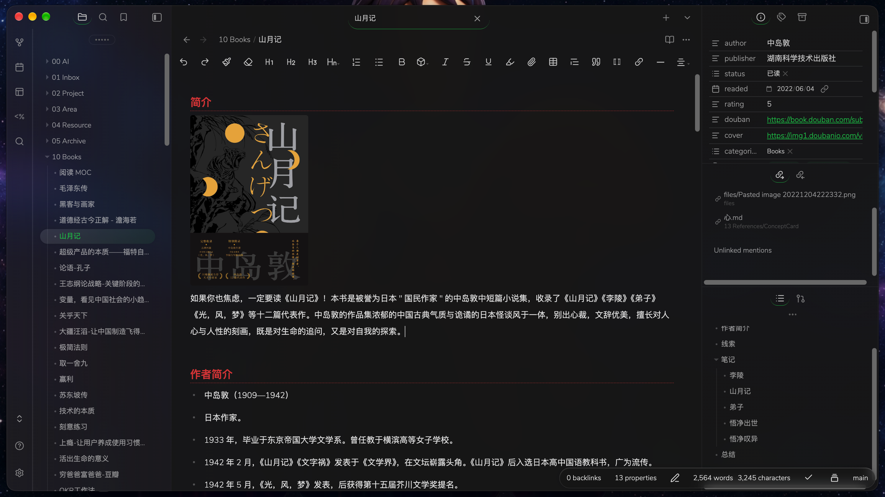
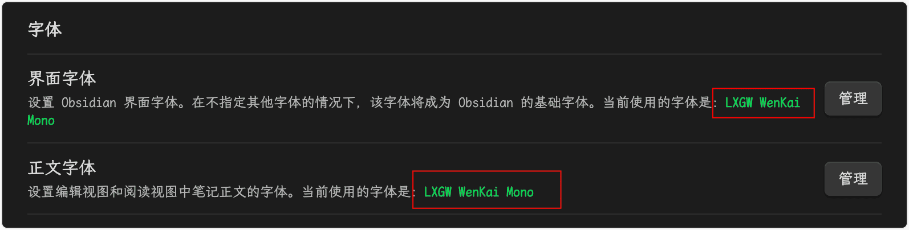
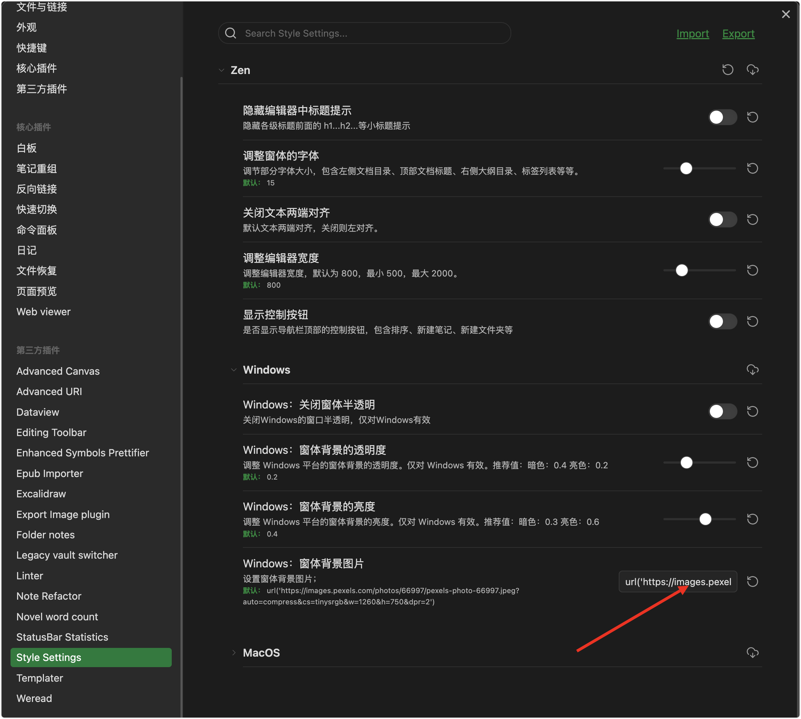

# Zen

A modern, minimalist Obsidian theme designed for focused writing and comfortable reading.

[English](./README.md) · [简体中文](./README.zh-CN.md)

## Overview

Zen removes unnecessary visual clutter, uses whitespace to separate interface regions, and brings a soft translucent aesthetic to Obsidian. Typography, spacing, lists, and navigation have been refined for a consistent writing experience across reading and editing views, with dedicated optimizations for Chinese content.

## Features

- Minimal interface with generous whitespace and fewer dividing lines
- Translucent, blurred window styling on macOS
- Custom background-image support on Windows and Linux
- Aligned folder trees, ordered lists, unordered lists, and indentation guides
- Colored tab indicators and heading levels
- Carefully tuned letter spacing and line height for writing and reading
- Consistent styling between Live Preview and Reading view
- Responsive experience for desktop and mobile
- Built-in options for the [Style Settings](https://github.com/mgmeyers/obsidian-style-settings) plugin

## Requirements

- Obsidian 1.9.0 or later
- The optional Style Settings plugin is recommended for visual customization

## Installation

### Community Themes

1. Open **Settings → Appearance** in Obsidian.
2. Select **Manage** under Themes.
3. Search for **Zen** in Community Themes.
4. Select **Install and use**.

### Recommended font

For better alignment between list markers and indentation guides—especially in Chinese notes—install **LXGW WenKai Mono**:

- [Download LXGWWenKaiMono-Regular.ttf](https://github.com/lxgw/LxgwWenKai/releases/download/v1.510/LXGWWenKaiMono-Regular.ttf)
- [Browse the LXGW WenKai font family](https://github.com/lxgw/LxgwWenKai)

## Platform notes

### macOS

To enable the translucent background effect, turn on **Settings → Appearance → Translucent window** in Obsidian.

### Windows and Linux

Zen uses a background image to create a similar atmosphere because desktop wallpaper translucency is not available on these platforms. To use a custom image:

1. Install and enable the [Style Settings](https://github.com/mgmeyers/obsidian-style-settings) plugin.
2. Open **Settings → Style Settings → Zen → Windows/Linux**.
3. Set **The background picture of the window** to an image URL.

## Plugin compatibility

Zen includes visual optimizations for the following community plugins:

- Advanced Canvas
- Dataview
- Editing Toolbar
- Export Image
- Floating Search
- Folder Notes
- Iconic
- Mindmap NextGen
- Note Refactor
- Novel Word Count
- Quiet Outline
- Weread

Compatibility may change as Obsidian and community plugins evolve.

## Support

If Zen improves your Obsidian experience, you can support its development:

- [Follow @laughmaker on GitHub](https://github.com/laughmaker)
- [Buy me a coffee via PayPal](https://www.paypal.com/paypalme/laughmakering)

## Disclaimer

Zen is primarily designed around the author's personal Obsidian workflow on macOS and has not been tested across every operating system or setup. Because it customizes significant parts of the Obsidian interface, future Obsidian updates or custom CSS snippets may cause compatibility issues.

## License

Zen is distributed under the [MIT License](./LICENSE.txt). If you modify, redistribute, or extract parts of the theme as standalone snippets, retain the applicable copyright and license notices.
