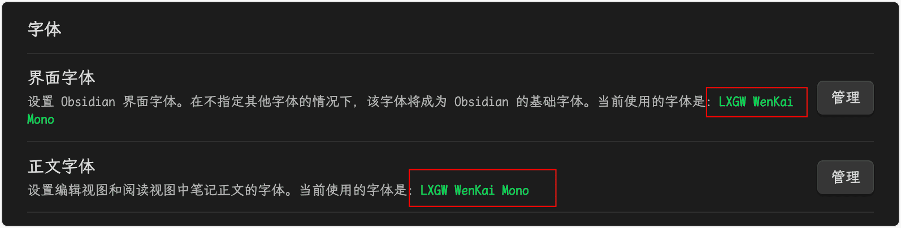
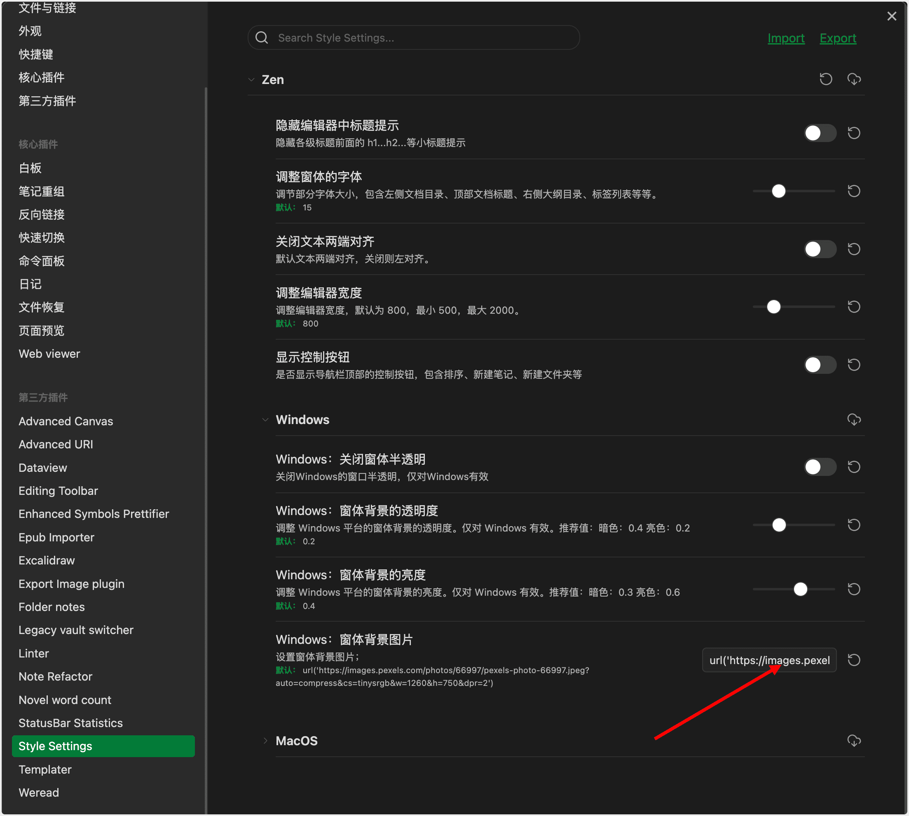
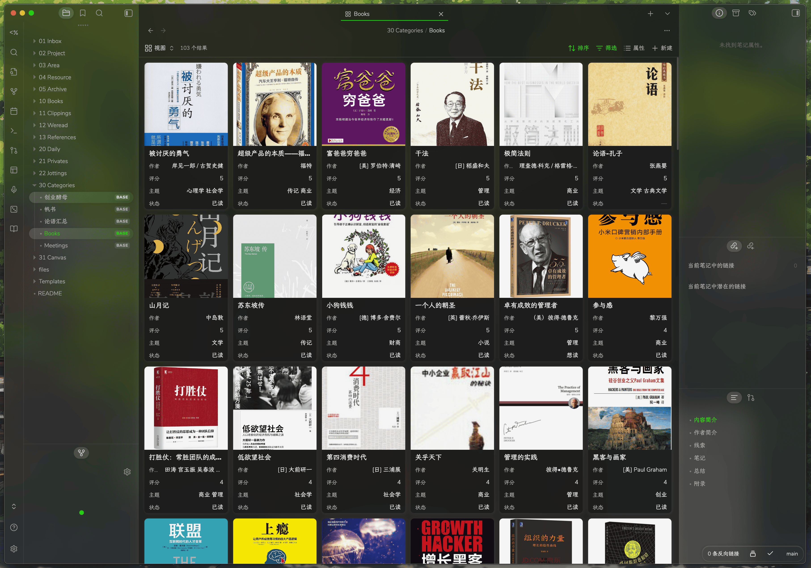
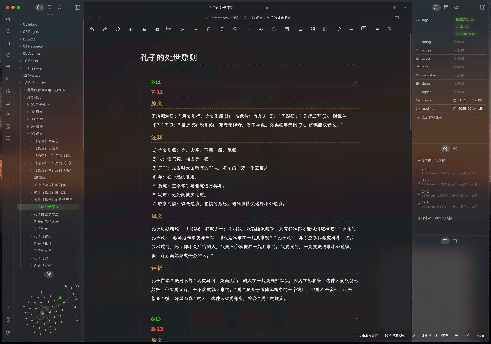
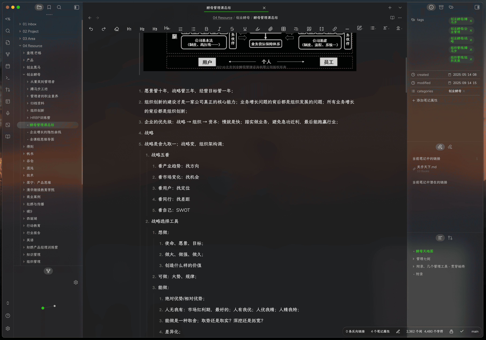

[中文](#Chinese) ｜ [English](#English)

[Screenshots](#Screenshots)

# <a id="Chinese"> 中文 </a>

Zen 是一个专注于写作而生的现代化主题。去除了影响写作和阅读的冗余元素，大量的运用了高斯模糊效果，具有现代化的简约风格。同时针对中文用户做了专门的优化。

备注：

-   在 Mac 平台，背景高斯模糊效果需要开启半透明选项。路径：设置 -> 外观 -> 半透明效果。
-   Windows 平台由于新版除除了开启半透明选项，故采用折衷的办法，在代码里内置图片来实现，如需定义，请到最后查看教程。
-   部分参数，已可通过 Style Settings 插件进行配置。

# Buy me a Coffee

如果您喜欢我的主题，可以请我喝杯咖啡。

If you like my theme, you can buy me a cup of coffee.

## 一、安装

安装主题的步骤如下：

-   打开 Obsidian 设置
-   进入“外观”设置并点击“管理”
-   在社区主题中搜索“Zen”，然后点击“使用”

**为了确保序号和引导线对齐，以及有更好的中文体验，请安装字体**：
`LXGWWenKaiMono-Regular.ttf`

-   当前使用字体：https://github.com/lxgw/LxgwWenKai/releases/download/v1.510/LXGWWenKaiMono-Regular.ttf
-   其他家族字体参考： https://github.com/lxgw/LxgwWenKai

## 二、特性

1. 窗体：背景现化化的背景高斯模糊效果；
2. 窗体：采用留白来区分块，移除大量的线条；
3. 目录页：采用倒三角和\*来区分目录和文件，并使 guideline(缩进参考线)对齐；
4. 标签页：采用彩色下划线指示；
5. 编辑器页：大量的调整字间距和行间距，使编辑和阅读更舒适；
6. 编辑器页：针对有序列表和无序列表，严格对齐 guideline(缩进参考线);
7. 标题：不同层级采用彩色显示，并增加标题序号提示；
8. 列表：阅读模藏和编辑模式，尽可能保持一致的体验；
9. 移动端：体验基本保持与 PC 端尽可能一致；
10. Windows 端：增加高斯模糊背景效果。

已优化插件列表：

1. Advanced Canvas
2. Dataview
3. Editing Toolbar
4. Export Image plugin
5. Floating Search
6. Folder notes
7. Iconic
8. Mindmap NextGen
9. Note Refactor
10. Novel word count
11. Weread
11. Quiet Outline

## 三、Win 如何替换背景？

由于 Windows 平台的限制，obsidian 官方从 1.6.7 版本，移除了背景半透明效果，所以针对 Windows 平台的实现，采用了图片的方式，不能穿透桌面壁纸。

如果需要更换背景图，可按如下操作：

1. 安装插件 Style Settings；
2. 找到 Windows: 窗体背景图片 设置项，从网上找到一张图片，替换到里面的单引号部分
   

# <a id="English">English </a>

Zen is a modern theme designed specifically for writing. It removes redundant elements that can affect writing and reading, extensively uses Gaussian blur effects, and features a modern minimalist style. It has also been specifically optimized for Chinese users.

Notes:

-   On the Mac platform, the Gaussian blur effect for the background requires the translucent option to be enabled. Path: Settings -> Appearance -> Translucent Effect.
-   On the Windows platform, since the new version has removed the translucent option, a compromise method is used by embedding images in the code to achieve the effect. For definitions, please refer to the tutorial at the end.

## 一、Installation

To install the theme

-   Open Obsidian Settings
-   Go to Appearance and click Manage
-   Under community themes search for "Zen" and click Use

To ensure that the numbers and guide lines are aligned, and for a better Chinese experience, please install the font：

`LXGWWenKaiMono-Regular.ttf`

-   Used Font：https://github.com/lxgw/LxgwWenKai/releases/download/v1.510/LXGWWenKaiMono-Regular.ttf
-   Other Font： https://github.com/lxgw/LxgwWenKai

## 二、Features

1. Windows: The background features a modernized Gaussian blur effect.
2. Windows: Utilizes whitespace to distinguish blocks, removing a large number of lines.
3. Table of Contents Page: Employs inverted triangles and asterisks (\*) to differentiate between directories and files, and aligns the guideline (indentation reference line).
4. Tab Page: Uses colored underlines for indication.
5. Editor Page: Extensive adjustments to letter spacing and line spacing are made to enhance the comfort of editing and reading.
6. Editor Page: For ordered and unordered lists, the guideline (indentation reference line) is strictly aligned.
7. Headings: Different levels are displayed in color, with added heading number prompts.
8. Lists: The reading mode and editing mode aim to maintain a consistent experience as much as possible.
9. Mobile: The experience is kept as consistent as possible with the PC version.
10. Windows: Adds a Gaussian blur background effect.

## 三、How to replace backgroundImage in Windows？

Due to the limitations of the Windows platform, the official Obsidian removed the semi-transparent background effect starting from version 1.6.7. Therefore, for the implementation on the Windows platform, an image-based approach is used, which does not allow the background to be transparent to the desktop wallpaper.

If you need to change the background image, follow these steps:

1. Install plugin Style Settings；
2. Find the "Window: Form background picture" setting item. Find a picture from the Internet and replace the single quotation mark part.
   

# <a id="Screenshots"> Screenshots </a>

## Mac

## Mobile

# **Support development:** [follow me](https://github.com/laughtmaker)

# Disclaimer

This theme is provided as is, and is designed for my personal use of Obsidian on macOS. As such it is not thoroughly tested across all operating systems and use cases.

This theme modifies significant parts of the Obsidian interface, so it may break with future updates. It may also be incompatible with other bits of custom CSS you have.

# License

Zen for Obsidian apps is licensed under the MIT License which allows you to modify and redistribute the code, however you must preserve the copyright and license notice in your CSS file. This includes any code you may extract as standalone snippets.
